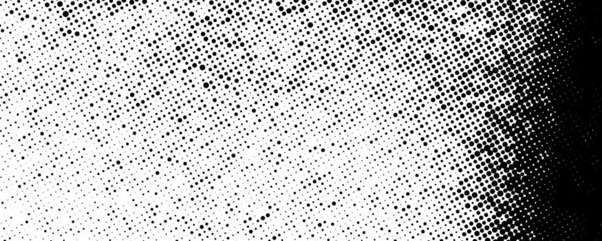

# 학습 기록 · 점 배경(하프톤 도트)

## 0. 만들고 싶었던 것



레퍼런스 같은 **그런지 하프톤 도트**: 점은 균일한 격자에 찍히되, 왼→오른쪽으로 갈수록 커지고(밀도 증가), 그 경계가 우둘투둘한 효과.

처음 막혔던 질문 두 가지:

- 점을 **균일한 위치**에 어떻게 찍나?
- **일정하지만 불규칙한** 점 크기를 어떻게 만드나?

→ 결론적으로 **`floor`/`fract`(위치) + `hash(id)`(고정 랜덤)** 두 가지로 풀린다.

## 1. 프래그먼트 셰이더는 픽셀마다 실행된다

- `main()`은 한 번이 아니라 **화소 수만큼(≈200만 번)** 실행되고, GPU가 **병렬**로 돌린다. 그래서 전체 픽셀을 도는 `for`가 없다.
- **깨달음**: "한 번만 돈다면 200만 픽셀이 다 같은 색이어야 한다" → 모순이니 픽셀마다 도는 게 맞다.

## 2. 픽셀마다 달라지는 입력 = `vUv` (varying)

- `uniform`(`uResolution`, `uGridSize`…)은 **모든 픽셀에서 동일**.
- 픽셀마다 다른 건 버텍스 셰이더가 내보낸 값을 GPU가 **보간(interpolation)** 한 `vUv`. (GLSL 용어로 `varying`)
- 이 구분이 셰이더의 절반이다.

## 3. `fract`로 균일한 격자 만들기

```glsl
vec2 grid = uv * uGridSize;
vec2 id   = floor(grid);     // 칸 번호(주소) — 칸 안에서 불변
vec2 cell = fract(grid) - 0.5;
```

- `fract(x)` = 소수 부분 (`fract(0.9)=0.9`, `fract(1.0)=0.0`, `fract(1.1)=0.1`).
- `fract(uv.x * 5)`는 직선(y=x)이 아니라 **0→1 올라갔다 0으로 뚝 떨어지는 톱니**가 5번 반복. → "칸을 5개로 나눈다".
- `uGridSize`를 20으로 키우면 칸 20개 → 점이 더 많고 작고 촘촘.

## 4. `- 0.5`로 칸 중심을 0으로

- `fract`만 쓰면 칸 좌표가 0~1, 0이 되는 지점은 **모서리**.
- `- 0.5`로 -0.5~0.5 → 0이 **칸 정중앙**.
- 그래야 `length(cell)`이 "중심으로부터의 거리"가 되어 점이 칸 가운데 동그랗게 박힌다.
- **break-it**: `- 0.5`를 지우면 점이 칸 모서리에 1/4쪽씩 박힌다.

## 5. `smoothstep`으로 거리 → 점

```glsl
float dot = smoothstep(radius, radius - 0.05, length(cell));
vec3 color = mix(uBgColor, uDotColor, dot);
```

- 의미: **중심까지 거리가 `radius`보다 가까우면 `dot=1`(점), 멀면 0(배경).**
- 첫 인자가 더 큰 "뒤집힌" 순서라 _가까울수록 1_. `0.05`는 가장자리 안티에일리어싱.
- `radius`가 커지면 점이 커진다.

## 6. `radius`를 정하는 법 = 이 패턴의 핵심

```glsl
float density = pow(vUv.x, uDensityPower);            // 좌→우 밀도
float rnd     = hash(id);                              // 칸별 고정 랜덤
float radius  = clamp(density + (rnd - 0.5) * uJitter, 0.0, 1.0) * 0.5;
```

### 6-a. `x²` 밀도 — 오른쪽 쏠림

- `density = vUv.x²`: 왼쪽(0)→0, 오른쪽(1)→1. 점이 오른쪽으로 갈수록 커진다.
- 왜 `x`가 아니라 `x²`? 중앙(0.5)에서 `x`=0.5 vs `x²`=0.25 → 제곱이면 왼쪽~중앙에서 **작게 오래 머물다** 오른쪽 끝에서 급증.
- `uDensityPower`를 키울수록(2→4) 큰 점들이 **오른쪽으로 더 쏠린다**.

### 6-b. `hash(id)` — 일정하지만 불규칙

- `hash`는 입력으로 받은 좌표로 고정된 난수를 만든다. `id`는 칸 안에서 불변 → **한 칸 = 하나의 고정 크기** (시간이 지나도 안 변함 = "일정함").
- **break-it**: `hash(id)`를 `hash(cell)`로 바꾸면 칸 안에서 픽셀마다 랜덤 → 동그란 점이 아니라 **노이즈**가 된다.

### 6-c. `(rnd - 0.5)` — 우둘투둘한 경계

- `rnd`는 0~1. 그냥 더하면 radius가 **커지기만** 함.
- `- 0.5`로 -0.5~+0.5 → 칸마다 기준선보다 **커지기도 작아지기도** → 점이 사라지는 경계가 깔끔한 세로선이 아니라 **우둘투둘**해진다 (그런지 느낌).

## 전체 파이프라인 한 줄 요약

> 픽셀마다 실행 → 픽셀별 `vUv` → `fract`로 격자 분할 → `-0.5`로 칸 중심을 0에 → 중심까지 `length` 거리 → `smoothstep`으로 반지름 안쪽을 점으로 → 그 **반지름**을 `x²` 밀도(좌→우) + `hash(id)` 칸별 랜덤(우둘투둘)으로 결정

## 더 해볼 것

- 밀도 방향을 `vUv.x` 대신 `vUv.y`나 대각선(`vUv.x + vUv.y`)으로 바꿔보기.
- `hash(id + 17.0)`로 시드를 하나 더 뽑아 점 크기 자체에 추가 랜덤 주기.
- `cell -= (vec2(hash(id), hash(id+5.0)) - 0.5) * jitter`로 점 위치도 살짝 흩뜨리기.
